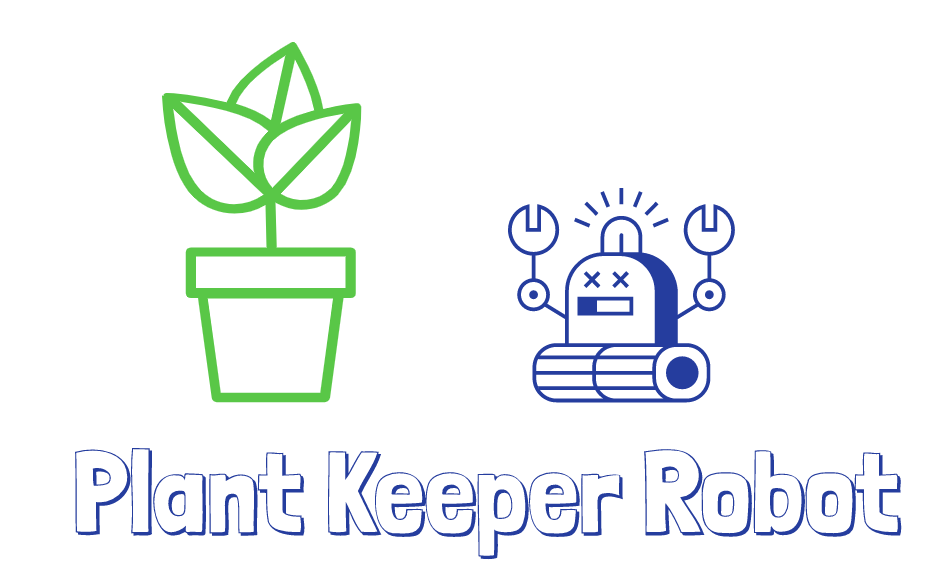

.. image:: https://img.shields.io/badge/Python-3.8.1-<COLOR>.svg
   :target: https://www.python.org

.. image:: https://readthedocs.org/projects/one-green/badge/?version=latest
    :target: https://one-green.readthedocs.io/en/latest/?badge=latest
    :alt: Documentation Status

.. image:: https://travis-ci.org/shanisma/plant-keeper.svg?branch=master
   :target: https://travis-ci.org/shanisma/plant-keeper

.. image:: https://img.shields.io/badge/code%20style-black-000000.svg
    :target: https://github.com/psf/black

.. image:: https://img.shields.io/badge/License-CC0%201.0-lightgrey.svg
   :target: https://creativecommons.org/publicdomain/zero/1.0/deed.en

.. image:: https://img.shields.io/badge/Ask%20me-anything-1abc9c.svg
   :target: mailto:shanmugathas.vigneswaran@outlook.fr

Summary
=======

This project provides a complete framework for plant cultivation both indoors and outdoors.

Master
------

The framework is composed of a Master including functionalities such as:

- API Gateway for data digestion (written in Python/Django)

- Graphical interface to configure the components (Django admin interface – future is Angular webapp !)

- Interface for monitoring and alert management (Grafana)

- Controllers to ensure to send good signal to activated, deactivate valve, pump etc …

Nodes
-----

The second part of framework is Node ESP32 MicroPython Client class

Repository : https://github.com/shanisma/pk-node-client

Import client, select Node Type (sprinkler, water pump, cooler, heater …)

Reuse:

sensors + codes to push to Master
Pin Out needed to be activated/deactivated

.. image:: docs/images/grafana_1-min.png
   :width: 600
   :align: center

QuickStart : Docker way
=======================

Tested with this configuration

- Server board : Raspberry PI 3 B+

- Wifi dongle for creating Wifi Access Point: TP-Link TL-WN823N

- Docker + docker-compose installed

.. code-block:: shell

    git clone https://github.com/shanisma/plant-keeper.git
    cd plant-keeper
    docker-compose up -d

QuickStart: Install MicroK8s
============================

Install tiny Kubernetes cluster on you machine (Raspberry Pi compatible): https://microk8s.io/

Arm guideline : https://microk8s.io/docs/install-alternatives#heading--arm

.. code-block:: shell

    # https://microk8s.io/docs/install-alternatives#heading--arm
    # for Arm add cgroup_enable=memory cgroup_memory=1
    # if not applied Node will not be ready : https://github.com/ubuntu/microk8s/issues/728
    sudo sed -i '${s/$/ cgroup_enable=memory cgroup_memory=1/}' /boot/firmware/cmdline.txt
    reboot

    # install snap + add snap binaries in PATH
    sudo apt update
    sudo apt install snapd
    sudo iptables -P FORWARD ACCEPT
    sudo echo "export PATH=\$PATH:/snap/bin" >> ~/.bashrc
    sudo source ~/.bashrc

    # Install Docker + MicroK8s + Helm3
    sudo snap install docker
    sudo snap install microk8s --classic
    sudo microk8s.enable dns dashboard storage ingress helm3
    sudo microk8s.stop
    sudo microk8s.start

    # Create Aliases
    echo "alias kubectl=\"sudo microk8s.kubectl\"" >> ~/.bashrc
    echo "alias k=\"sudo microk8s.kubectl\"" >> ~/.bashrc

    echo "alias helm=\"sudo microk8s.helm3\"" >> ~/.bashrc
    echo "alias h=\"sudo microk8s.helm3\"" >> ~/.bashrc
    source ~/.bashrc

QuickStart: Kubernetes
======================

Deploy Plant Keeper in Kubernetes

- Helm chart for Loki and Grafana

- Yaml files for TimeScaleDB , Plant-Keeper Api GateWay , Plant-Keeper Controllers

.. code-block:: shell

    # Raspbery Pi => suppose microk8s is used
    kubectl create namespace plant-keeper

    helm repo add stable https://kubernetes-charts.storage.googleapis.com
    helm repo add loki https://grafana.github.io/loki/charts
    helm repo add grafana https://grafana.github.io/helm-charts
    helm repo update
    # ----- if you are using microk8s
    helm upgrade --install grafana grafana/grafana -n plant-keeper \
        --set persistence.enabled=true \
        --set persistence.type=pvc \
        --set persistence.size=1Gi \
        --set storageClassName=microk8s-hostpath
    kubectl apply -f kubernetes/grafana-service-patch.yaml

    # ----- if ingress available
    helm upgrade --install grafana grafana/grafana -n default \
        --set persistence.enabled=true \
        --set persistence.type=pvc \
        --set persistence.size=1Gi \
        --set ingress.enabled=true \
        --set ingress.hosts={grafana.<FQDN provided by cloud provider>}

    helm upgrade --install loki loki/loki  -n plant-keeper
    # Apply manifest from this repository
    git clone https://github.com/Plant-Keeper/plant-keeper-master.git
    kubectl apply -f plant-keeper-master/kubernetes/ -n plant-keeper

    # Wait pod creation
    kubectl get po -n plant-keeper # --watch to refresh automatically

    # Retrieve Grafana password
    # default user = admin
    kubectl get secret -n plant-keeper  grafana -o jsonpath="{.data.admin-password}" | base64 --decode ; echo

Once Pods are ready, open web browser :

    - Api Gateway swagger:  http://<Machine external IP>:31801

    - Grafana Dashboard: http://<Machine external IP>:31300

More
====

Documentations : https://plant-keeper.readthedocs.io/en/latest/?badge=latest
