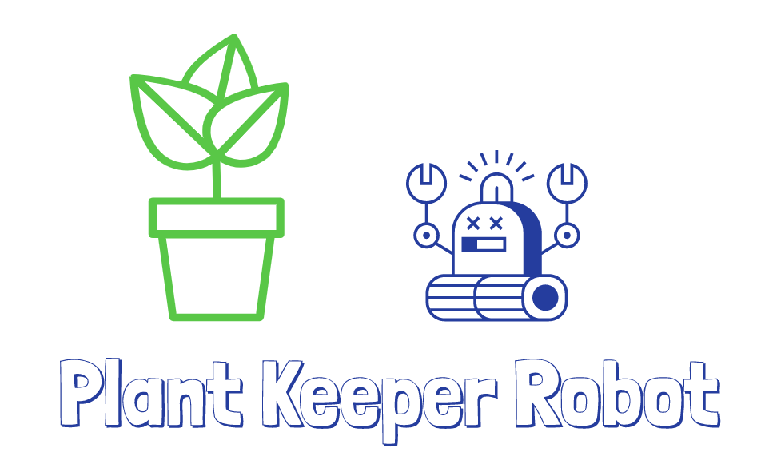

.. image:: https://img.shields.io/badge/Python-3.7.4-<COLOR>.svg
   :target: https://www.python.org

.. image:: https://travis-ci.org/shanisma/plant-keeper.svg?branch=master
   :target: https://travis-ci.org/shanisma/plant-keeper

.. image:: https://img.shields.io/badge/Ask%20me-anything-1abc9c.svg
   :target: mailto:shanmugathas.vigneswaran@outlook.fr

Summary
=======

This project proposes an automated management of your indoor green plant.
Including control of temperature, hygrometry, watering, UV lighting, air quality, CO2 level, and lot of other things.
Controller classes are included in project **core** package

All stages of measurement, control and action are separated.

QuickStart : Docker way
=======================

Tested with this configuration

- Server board : Raspberry PI 3 B+

- Wifi dongle for creating Wifi Access Point: TP-Link TL-WN823N

If you want use dedicated Wifi Access Point for Plant-Keeper use RaspAP https://github.com/billz/raspap-webgui.
This is the quicker way to set and configure Wifi Access Point, you need USB Wifi Dongle.

From https://raw.githubusercontent.com/billz/raspap-webgui/master/README.md

Install RaspAP from your RaspberryPi's shell prompt:

.. code-block:: shell

    sudo apt update && sudo apt install -y wget
    wget -q https://git.io/voEUQ -O /tmp/raspap && bash /tmp/raspap

The installer will complete the steps in the manual installation (below) for you.

After the reboot at the end of the installation the wireless network will be
configured as an access point as follows:

- IP address: 10.3.141.1
    - Username: admin
    - Password: secret
- DHCP range: 10.3.141.50 to 10.3.141.255
- SSID: **raspi-webgui**
- Password: **ChangeMe**

Docker way to quick start Plant-Keeper + Postgres + Grafana, follow steps here:

.. code-block:: shell

    # install docker-ce
    curl -sSL https://get.docker.com | sh
    sudo usermod -aG docker pi

    # install docker-compose
    sudo apt install libffi-dev python-pip python-backports.ssl-match-hostname
    # sudo pip install --upgrade docker docker-compose

    # Run Plant keeper (will build plant-keeper only once)
    sudo docker-compose up
    # Run Plant keeper (force rebuild plant-keeper : update/release)
    sudo docker-compose up --build

Access to Django Admin :
    - default credentials: login=plant/pwd=keeper
    - Not using RaspAP: http://<RaspberryIP>:8001/admin
    - With RaspAP: http://10.3.141.1:8001/admin

Access to Swagger :
    - no credentials required
    - Not using RaspAP: http://<RaspberryIP>:8001
    - With RaspAP :  http://10.3.141.1:8001

Access to Grafana:
    - default credentials : login=admin/pwd=admin
    - Not using RasAP: http://<RaspberryIP>:3000
    - With RaspAP : http://10.3.141.1:3000

Grafana add Postgres data source, and load default dashboard:
    - Use Postgres Data source
    - Use **host = db , database = postgres, user= postgres, ssl mode = disable** , , click on "Test and Save"
    - Load dashboard with "Create" button, click on "Import", click on "Upload .json file" and load **grafana.json**

Measurements
------------
For the measurements, it is possible to feed the database either by REST API,
or directly feed database with Python code in this part of project: **sensor/**.
It means that it is possible to use an Arduino to make measurements, in order to post the values to Raspberry PI by REST API,
or make measurements directly with Raspberry PI.

Lot of configuration is possible, such as this one :

.. code-block:: shell

    Sensor 1 ----------------------------------> Raspberry PI / PC (Plant Keeper Server) -------> DATABASE
                                                                        ^
                                                                        |
                                                   +---------+          |
    Sensor 2 ----> Arduino 1 --------------------> |         | ----------
                                                   |         |
    Sensor 3 ----> Arduino 2 --------------------> |  REST   |
                                                   |  API    |
    Sensor 4 ----> Raspberry PI  ----------------> |         |
                                                   +---------+

Controllers
-----------

Controllers will read in database latest value, and will take an action:

- value based like:
    - eg:  activate cooling system if temperature is too high
    - eg: activate vapor generator if hygrometry is too low

- time based :
    - eg: activate UV light in a time slot

.. code-block:: shell

    DATABASE ----------->  CONTROLLER  ----------->    DATABASE
                            shift last sensors,
                            update DB if controller
                            action require change status (OFF/ON)

Actuators
---------

Write custom actuators behaviours in **actuators/**

.. code-block:: shell

    DATABASE -----------> ACTUATOR ----------> ON/OFF DEVICES
                          check if any
                          change in DB

WIP
===

- Tests
- Controller for Raspberry PI

Technical & Used framework
==========================

- SQLite for dev purpose/hobby, change to Postgres for intense usage.
- Python 3.7 - used is this project
- Django Framework REST API server + Admin UI interface : https://www.djangoproject.com/
- Django Rest Framework : https://www.django-rest-framework.org/
- Swagger - API are auto documented, POST/GET with web browser OK : https://swagger.io/docs/specification/about/

Python and Django Based Plant controller
========================================

With this project you can automate plant growing ecosystem.

Use HTTP Rest API to save sensors values into database.

**Fully compatible with Raspberry PI**

How it work
===========

Sensor have ORM model (SQL table and relation representation in Python code with Django backend).

Action devices have also ORM model.

These ORM are used to save latest values such as : Enclosure temperature, water filling pump power status ...

There is special ORM model **plant_core.models.PlantSettings**, this one is used to save plant set point such as :

- Air Temperature
- Air Hygrometry
- Soil Hygrometry

1) Values inputs

- HTTP API

- Django ORM API

Binary controller & controller aggregation
------------------------------------------

Related class **core.controller.BaseController**

To take a device action based on sensor, a controller is needed.

BaseController require 3 arguments: type of controller, neutral point,
maximum delta, minimum delta.

- Type of controller must be string = 'CUT_IN' or 'CUT_OUT', in most case you should use 'CUT_OUT'
    there is a video to explain : https://www.youtube.com/watch?v=VwMn-5NV5eM

- Neutral point must be float, this a set point value, system always try to fit this value

- maximum delta and minimum delta :
    - if kind 'CUT_OUT' maximum delta is needed: action device will be in "POWER=ON" status if
      [sensor value] is greater than / equal to  [set point (= neutral point)  + maximum delta]. In
      Other conditions device be in "POWER=OFF"
    - if kind 'CUT_IN' minimum delta is needed [WIP]

Related class **core.aggregator.BaseAggregator**

In common case, one controller handle one device.

In some case, we can fact with two or three controller acting on one device. The meaning : one device assume more than one function.
A Peltier Cooling cell can decrease temperature, decrease hygrometry.
Use BaseAggregator([temperature_controller, hygrometry_controller]) to get only one action to take for a device.
Have a look in **controller.tests.peltier_controller.py** to test Aggregator.

Installation
------------

1) Install Python 3.7.4 and Pipenv

Use shell script **install_python_3.7.4.sh** to install Python 3.7.4,
this script will also install Pipenv.

.. code-block:: shell

    sudo bash install_python_3.7.4.sh

2) Install project packages from Pipfile

.. code-block:: shell

    sudo pipenv install

3) Make database migrations and do migrate

Before running Django server you need to create migrations, and update database.
(plant_core.models ORM to SQL tables and relations)

.. code-block:: shell

    sudo pipenv run python manage.py makemigrations
    sudo pipenv run python manage.py migrate

4) Create an admin user

To configure plant temperature, hygrometry, chart temperature sensors etc ... you must create and admin

.. code-block:: shell

    sudo pipenv run python manage.py createsuperuser
    # fill input requested by command line interface

5) Runserver

Run server and open a web browser to:

- http://localhost:8000 -> display Swagger API

- http://localhost:8000/admin -> to login in admin interface

End to end test a controller
============================

Run server with in development mode:

.. code-block:: shell

    sudo pipenv run python manage.py runserver
    # for prod use WSGI like gunicorn  / werkzeug / bjoern

Open web browser, login, and create PlantSettings entry , controller wil try to load these values.

For example, run cooler.py (cooler can decrease temperature and hygrometry)

.. code-block:: shell

    cd controllers && pipenv run python cooler.py

- In web browser use Swagger

- Select "/enclosure/" POST method

- Click on "Try it out"

- Enter manually values

- Click on "Execute"

.. image:: https://i.creativecommons.org/l/by-nc/4.0/88x31.png
    :target: https://creativecommons.org/licenses/by-nc/4.0/
    :align: center
