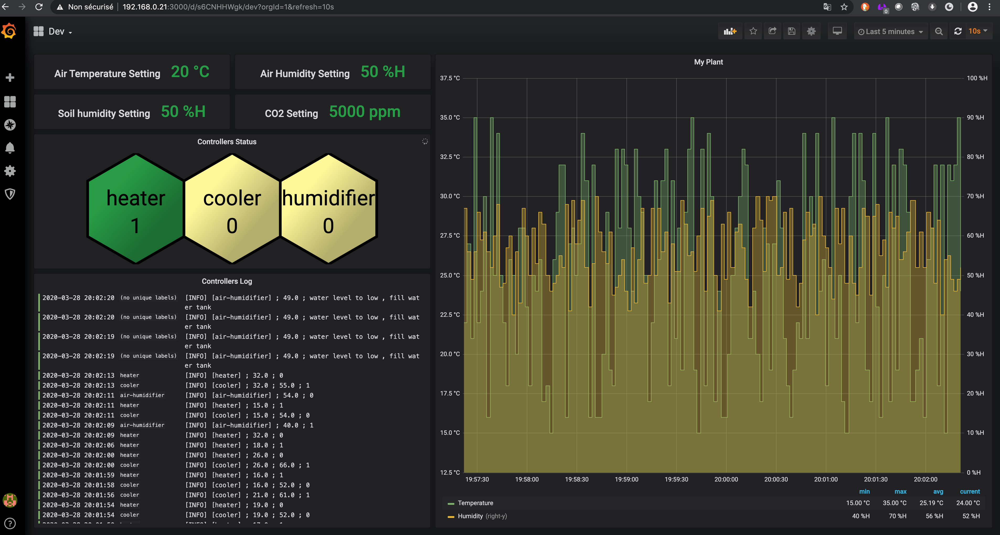

.. image:: static/main_logo.png
   :width: 200
   :align: center

.. image:: https://img.shields.io/badge/Python-3.8.1-<COLOR>.svg
   :target: https://www.python.org

.. image:: https://readthedocs.org/projects/plant-keeper/badge/?version=latest
    :target: https://plant-keeper.readthedocs.io/en/latest/?badge=latest
    :alt: Documentation Status

.. image:: https://pyup.io/repos/github/shanisma/plant-keeper/shield.svg
     :target: https://pyup.io/repos/github/shanisma/plant-keeper/
     :alt: Updates

.. image:: https://pyup.io/repos/github/shanisma/plant-keeper/python-3-shield.svg
     :target: https://pyup.io/repos/github/shanisma/plant-keeper/
     :alt: Python 3

.. image:: https://travis-ci.org/shanisma/plant-keeper.svg?branch=master
   :target: https://travis-ci.org/shanisma/plant-keeper

.. image:: https://img.shields.io/badge/code%20style-black-000000.svg
    :target: https://github.com/psf/black

.. image:: https://img.shields.io/badge/License-CC0%201.0-lightgrey.svg
   :target: https://creativecommons.org/publicdomain/zero/1.0/deed.en

.. image:: https://img.shields.io/badge/Ask%20me-anything-1abc9c.svg
   :target: mailto:shanmugathas.vigneswaran@outlook.fr

Summary
=======

This project provides a complete framework for plant cultivation both indoors and outdoors.

Master
------

The framework is composed of a Master including functionalities such as:

- API Gateway for data digestion (written in Python/Django)

- Graphical interface to configure the components (Django admin interface – future is Angular webapp !)

- Interface for monitoring and alert management (Grafana)

- Controllers to ensure to send good signal to activated, deactivate valve, pump etc …

Nodes
-----

The second part of framework is Node ESP32 MicroPython Client class

Repository : https://github.com/shanisma/pk-node-client

Import client, select Node Type (sprinkler, water pump, cooler, heater …)

Reuse:

sensors + codes to push to Master
Pin Out needed to be activated/deactivated

QuickStart : Docker way
=======================

Tested with this configuration

- Server board : Raspberry PI 3 B+

- Wifi dongle for creating Wifi Access Point: TP-Link TL-WN823N

- Docker + docker-compose installed

.. code-block:: shell

    git clone https://github.com/shanisma/plant-keeper.git
    cd plant-keeper
    docker-compose up -d

More
====

Documentations : https://plant-keeper.readthedocs.io/en/latest/?badge=latest
