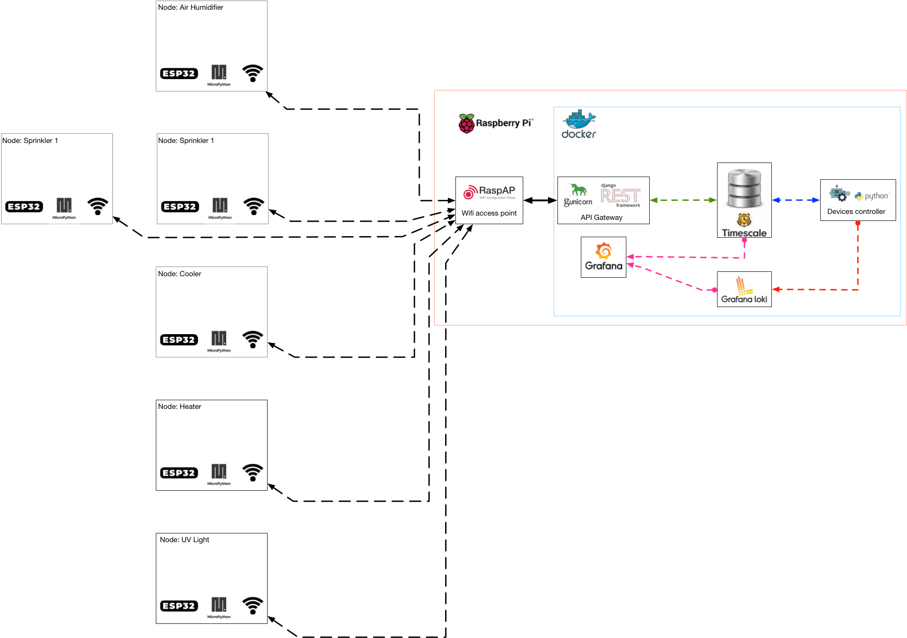

********
Overview
********

+--------------------+---------------+----------------+----------------------------+
| Conventional name  | Hardware      | Software       | Purpose                    |
+====================+===============+================+============================+
|                    |               | RaspAp         | Wifi Access point          |
|                    |               +----------------+----------------------------+
|                    |               | Docker         | Container isolation        |
|                    |               |                |                            |
|  Master            |  Raspberry Pi |                | Fast deployment            |
|                    |               +----------------+----------------------------+
|                    |               | Api Gateway    | Unique entry point for     |
|                    |               |                |                            |
|                    |               |                | Nodes communication        |
|                    |               +----------------+----------------------------+
|                    |               | TimescaleDB    | Time series data base      |
|                    |               +----------------+----------------------------+
|                    |               | Grafana        | Data visualisation         |
|                    |               |                |                            |
|                    |               |                | Alert Notification         |
|                    |               +----------------+----------------------------+
|                    |               | Loki           | Light weight Logger        |
|                    |               |                |                            |
|                    |               |                | Grafana native             |
+--------------------+---------------+----------------+----------------------------+
|                    |               | MicroPython    | Convenient way             |
|                    |               |                |                            |
| Nodes              | ESP 32        | PlantKeeper    | develop custom             |
|                    |               |                |                            |
|                    |               | client         | devices                    |
+--------------------+---------------+----------------+----------------------------+

.. note::

    * **Node** send sensors values to **Master**
    * **Node** don't take any logical decision
    * **Master** take decision and response Power OFF/ON signal based on settings

.. warning::

    * If **Node** don't update sensors value, **Master** will response Power OFF
    * If **Node** can't communicate with **Master**, will stay in Power OFF
