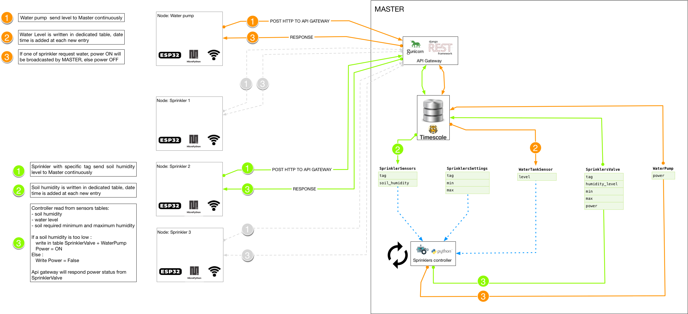

***************************************
Sprinklers controller (water pump also)
***************************************

.. note::

    * **Node** send sensors values to **Master**
    * **Node** don't take any logical decision
    * **Master** take decision and response Power OFF/ON signal based on settings

.. warning::

    * If **Node** don't update sensors value, **Master** will response Power OFF
    * If **Node** can't communicate with **Master**, will stay in Power OFF
