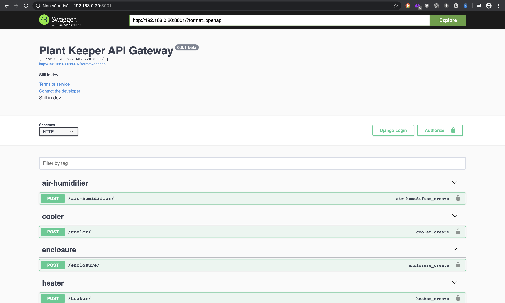
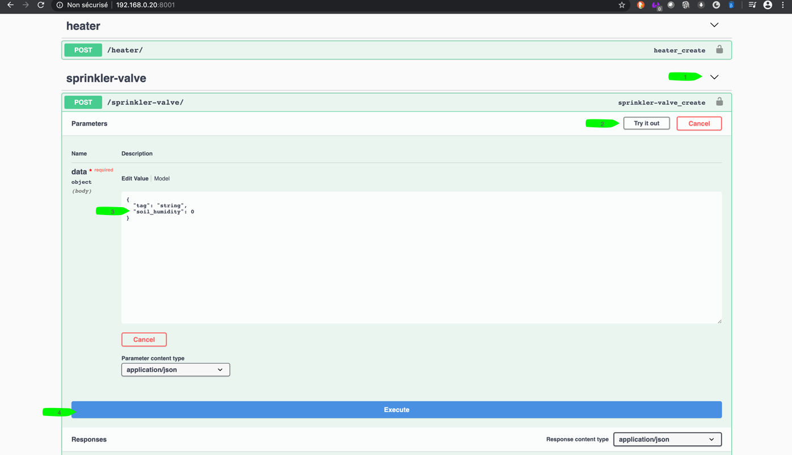
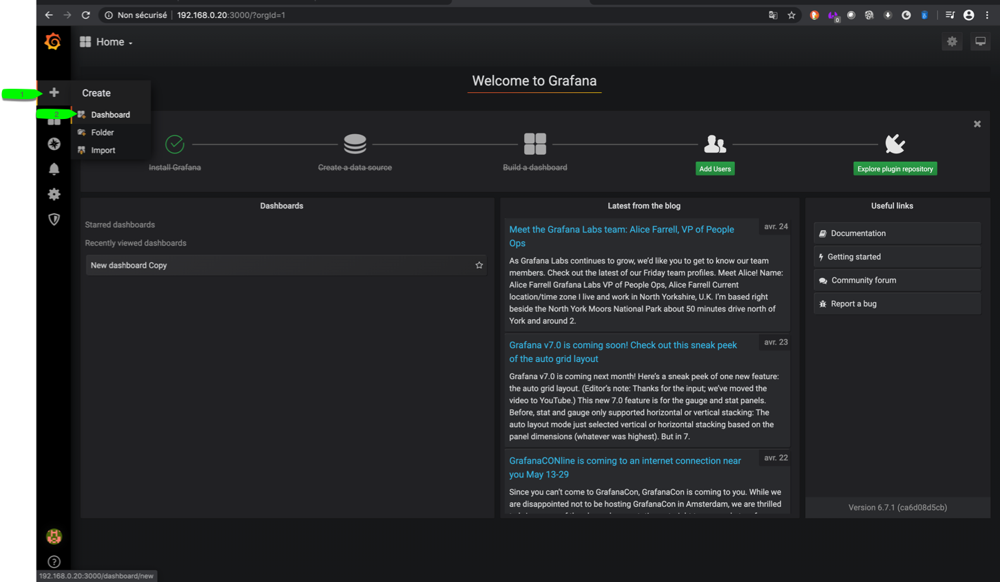
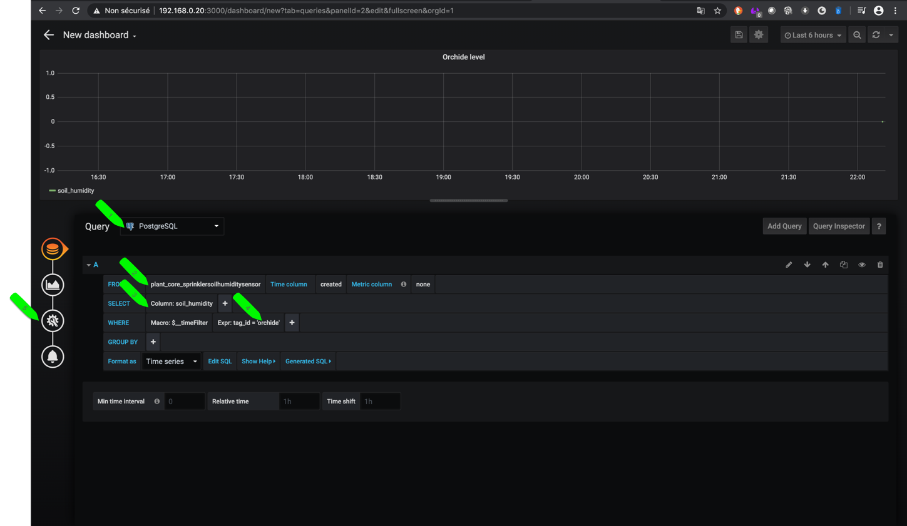
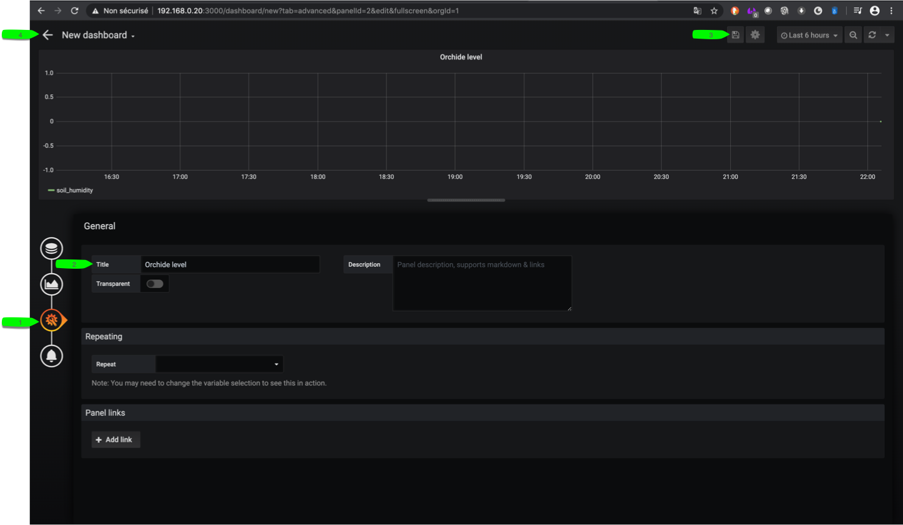
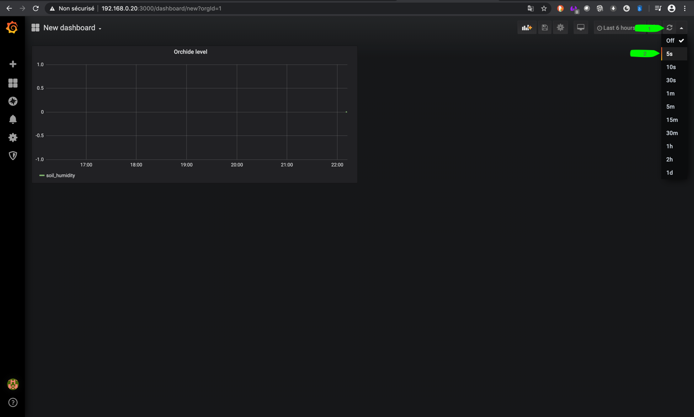
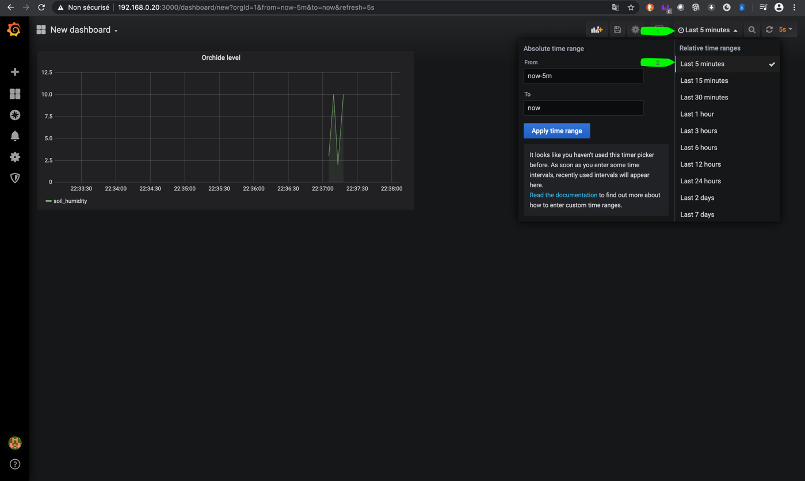
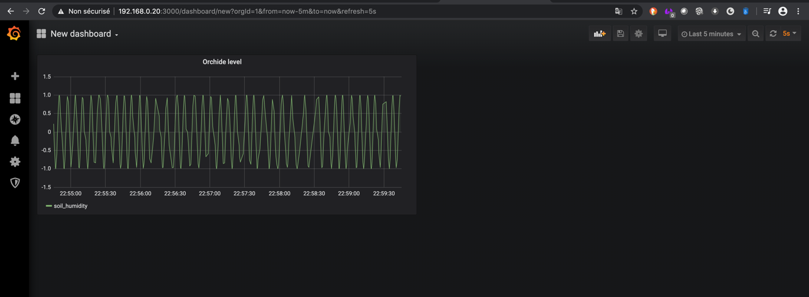

*****************
Play with Grafana
*****************

At this stage you don't need to setup ESP Node

We can use API to POST data to simulate sensors entry

Create dashboard: Sprinklers Sensors Table
==========================================

Plant-Keeper Master support multi Sprinkler, with unique **tag**

Each Sprinkler Node must send data to Api Gateway with a **tag**. **Tag** is created on the fly if not exist in database

Post value to Api Gateway with Web browser
------------------------------------------

Goto API Gateway : http://<raspberry_pi_IP>:8001/

Expand **sprinkler-valve** to send data trough web browser

.. note::

    Change "soil_humdity" and click **execute** , do it more than 5 times, to see plot in Grafana

    To simulate Node posting sensors values, you can **/tests/sprinkler.py**

    We will use this script later in the tutorial

Create simple graphic to visualise sensor values
------------------------------------------------

In another, page open Grafana

.. note::

    Great! You can read value added by your post

Run simulator
-------------

Edit tests/sprinkler.py , line 11 **api =  http://your-raspberry-pi-ip:8001/sprinkler-valve**
Run script to simulate sprinklers values with :

.. code-block:: shell

    # python3 is required
    # apt install python3
    cd tests
    python3 sprinkler.py
    # use crlt + c to stop simulator

.. note::

    This script will simulate sinusoid function from -1 to 1

Create dashboard: Sprinklers Controller Table
=============================================

WIP
