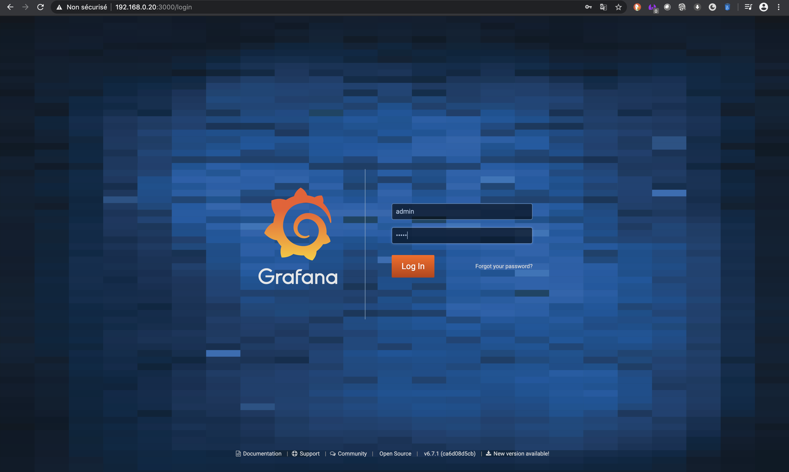
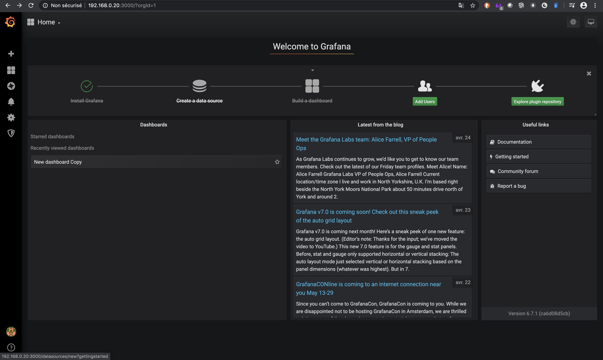
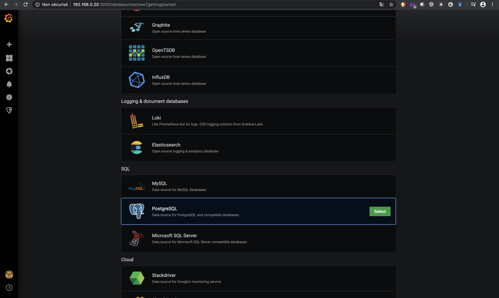
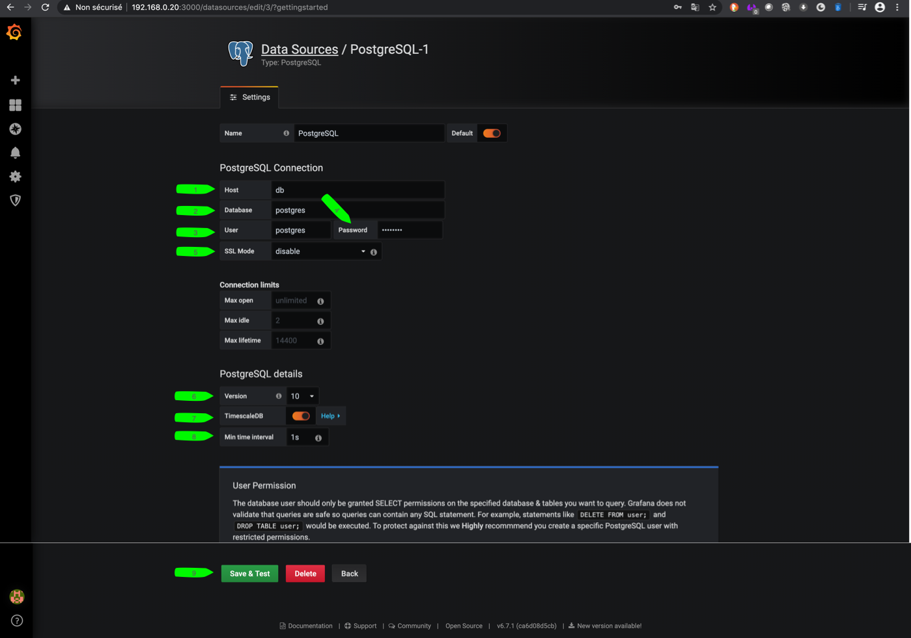
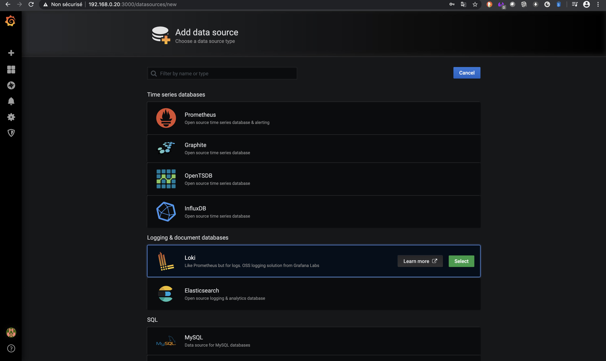

*************
Setup Grafana
*************

Grafana is the visualisation server for this project

Check if Grafana is up and running :

.. code-block::

    docker logs plant-keeper_grafana_1 | grep "HTTP Server Listen"
    # you should see text like :
    # t=2020-04-22T20:29:20+0000 lvl=info msg="HTTP Server Listen" logger=http.server address=[::]:3000 protocol=http subUrl= socket=

If you see this test, Grafana is up

First login and set password
=============================

Goto http://<raspberry_pi_IP>:3000/

Default login : **admin** , password : **admin**

.. note::

    You can skip password change at first login, can be done later

Add data source: Postgres (with Timescale plugin)
=================================================

Use for theses parameter for connexion :

- Database : **postgres**

- User : **postgres**

- Password : **postgres**

Add data source: Loki
=====================

Loki light weight, power full is distributed logs system

.. figure:: ../images/grafana_loki.png
    :height: 100
    :width: 200
    :scale: 300
    :align: center
    :alt: loki_datasource

.. note::

    You will never redo this step. Grafana data is saved on persistent volume
