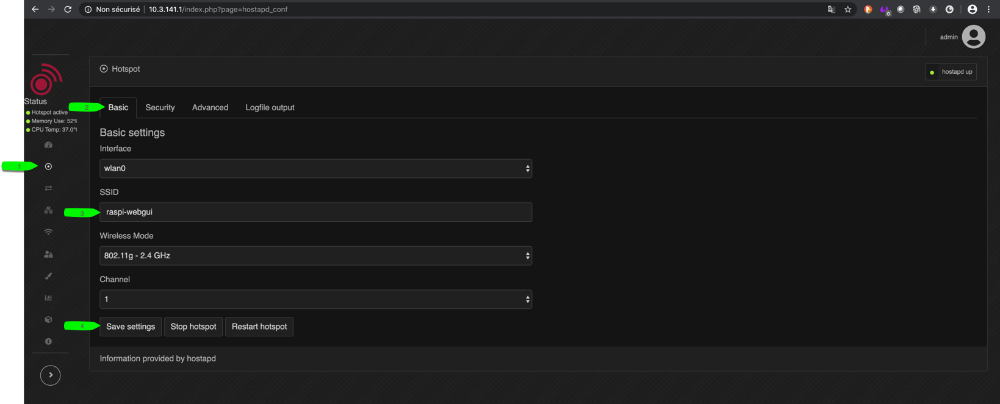
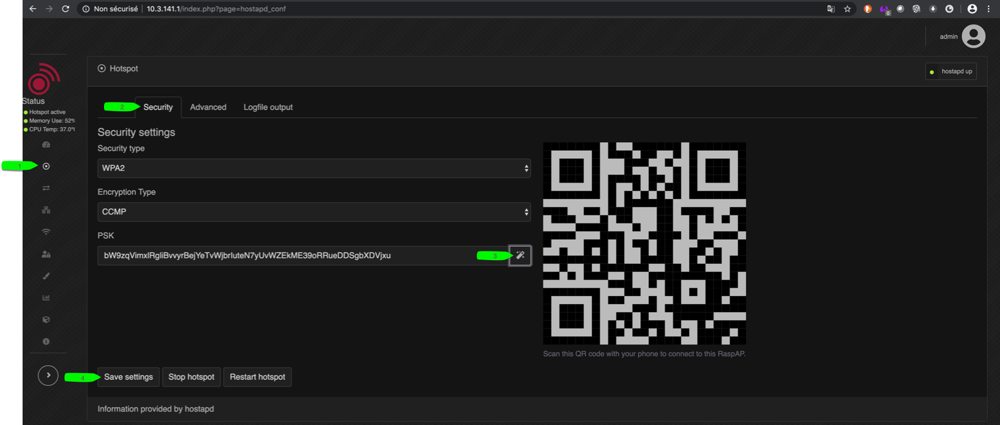

************
Setup master
************

For **Master**, you can use any computer, but Raspberry Pi is very suitable for this use

.. note::

    To create Plant Keeper's Wifi access Point you need to add Wifi dongle.

    You can use any of Wifi dongle here:  https://www.elinux.org/RPi_USB_Wi-Fi_Adapters

Flash OS on Raspberry Pi
========================

1) Download Raspbian latest Image : https://www.raspberrypi.org/downloads/raspbian/

.. note::

    Linux familiar user download **Raspbian Buster Lite**

    No Linux familiar user download: **Raspbian Buster with desktop and recommended software**

2) Insert your SD Card (32Gi recommended) on computer used for flashing

3) Flash OS :

    Use Etcher https://www.balena.io/etcher/ , load image, select SD Card , run flash

4) Activate SSH:

    In flashed SD Card add in root an empty file **ssh**

.. warning::

    If you don't wan't use additional screen, keyboard, mouse: adding this file (**ssh**) will allow you to establish
    SSH communication trough local network, especially for **Raspbian Buster Lite** which does not come
    with a graphical interface

Connect trough SSH
==================

Assume Raspberry Pi :

- SD Card is plugged with **Rasbian Buster Lite** OS

- is connected to local network thought ethernet wire

- is connected to power supply and running

.. note::

    Found Raspberry Pi Ip address with:

    - Windows user => AngryIp : https://angryip.org/

    - Macos user => LanScan : https://www.iwaxx.com/lanscan/

    - Linux/Debian user => apt install nmap -y && nmap -sP 192.168.0.0/10

For Macos/Linux user, use Terminal emulator

.. code-block:: shell

    ssh pi@192.168.<??>.<??>
    # default password for pi = raspberry

For Windows user : use Putty or any Windows SSH client ,
refer to official documentation : https://www.raspberrypi.org/documentation/remote-access/ssh/windows.md

.. note::

    Replace in IP address <??>.<??> by address found by scan

Upgrade OS
==========

Connect to Raspberry trough SSH or start Terminal if you use desktop version

.. code-block:: shell

    sudo apt-get update
    sudo apt-get dist-upgrade
    sudo reboot

Install RaspAP
==============

Full documentation :  https://raspap.com/

RaspAP will create Wifi Access Point

Ensure Wifi dongle is plugged in USB

Connect to Raspberry trough SSH or start Terminal if you use desktop version and run :

.. code-block:: shell

    curl -sL https://install.raspap.com | bash

Once installation completed, hardware restarted, you can access to

* **Web GUI for RaspAP**

    - IP address: 10.3.141.1

    - Username: admin

    - Password: secret

* **Wifi Access Point default configuration**

    - DHCP range: 10.3.141.50 to 10.3.141.255

    - SSID: raspi-webgui

    - Password: ChangeMe

You can connect on http://10.3.141.1 with user=admin and password=secret

1) Change RaspAP password http://10.3.141.1/index.php?page=auth_conf

2) Change Wifi Access Point configuration

.. warning::

    Do not skip RaspAP SSID password configuration !

Install Docker
==============

Docker is a tool that can package an application and its dependencies in an isolated container,
which can be run on any server

Official documentation : https://docs.docker.com/engine/install/debian/

Connect to Raspberry trough SSH or start Terminal if you use desktop version and run :

.. code-block:: shell

    curl -sSL https://get.docker.com | sh
    sudo usermod -aG docker pi

Check if Docker engine is running:

.. code-block:: shell

     docker info

.. note::

    If docker wont start, restart Raspberry Pi

Install docker-compose
======================

Docker Compose is a tool for defining and running multi-container Docker applications

Official documentation: https://docs.docker.com/compose/

Connect to Raspberry trough SSH or start Terminal if you use desktop version and run :

.. code-block:: shell

    sudo apt install python3 python3-pip
    pip3 install docker-compose

Start Plant Keeper Master
=========================

.. note::

    Change in **docker-compose.yml**, in service  **api-gateway**, change environment variable **HOST_IP**.

    By changing this variable, landing page button will point to good url

Connect to Raspberry trough SSH or start Terminal if you use desktop version and run :

.. code-block:: shell

    git clone https://github.com/shanisma/plant-keeper
    cd plant-keeper
    docker-compose -d up

Follow starting with :

.. code-block::

    docker-compose logs --follow
    # use ctrl + c to stop tail logs

Once Master started, you can access to: http://192.168.<??>.<??>:8001

    .. figure:: ../images/landing_page.png
        :height: 100
        :width: 200
        :scale: 300
        :align: center
        :alt: flow

.. note::

    If you can see dancing Baby Groot dancing Api gateway is running.

- Django Admin (plant settings) with credentials :

    - url : http://192.168.<??>.<??>:8001/admin

    - user: plant

    - password: keeper

- Api gateway

    - url : http://192.168.<??>.<??>:8001

- Grafana with credentials:

    - url : http://192.168.<??>.<??>:3000

    - user: admin

    - password: admin

.. note::

    Great ! If you are able to access to Grafana, APi Gateway.
    You will never redo this step, because docker container will restart automatically is case of crash

